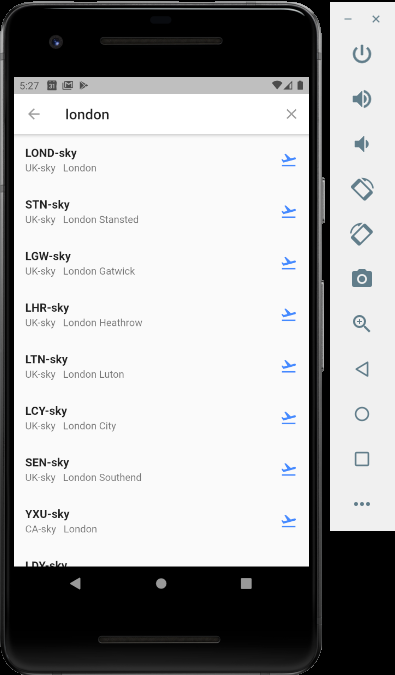
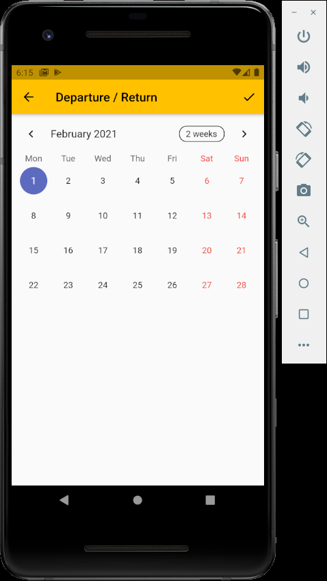
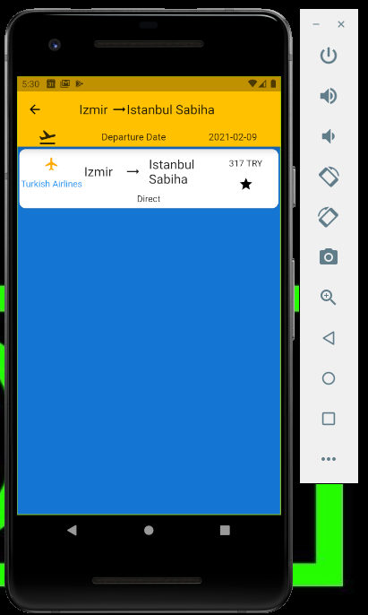
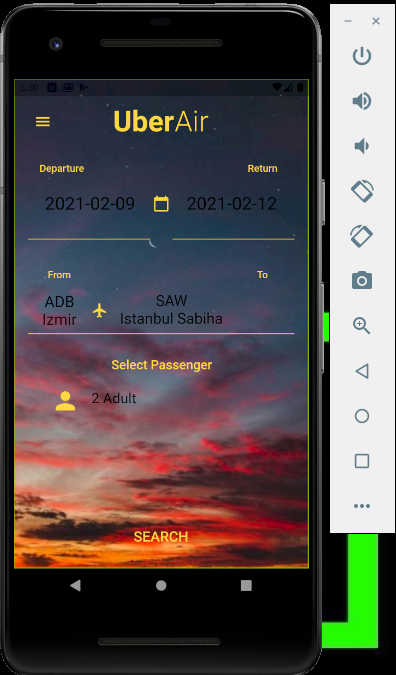
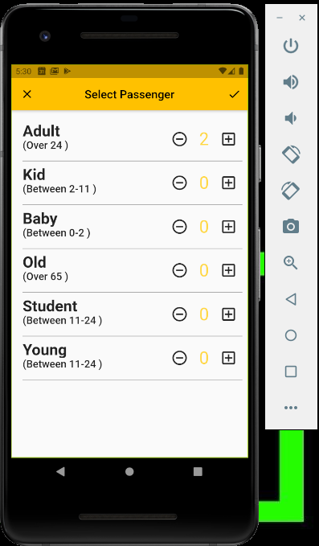

# Uber Air
 This is a simple flight booking app build with flutter.

Features 

  - Select Date
  - Get airport from skyscanner API
  - Select Passenger
  - Get flights from skyscanner API 
  - Google authentication

Tools

 - <a href="https://flutter.dev/">Flutter</a>

 - <a href="https://code.visualstudio.com/">Vscode</a>

 - <a href="https://www.partners.skyscanner.net/developer-documentation">Skyscanner</a>

 - <a href="https://firebase.google.com/">Firebase</a>
 
 
 
 
 
 
